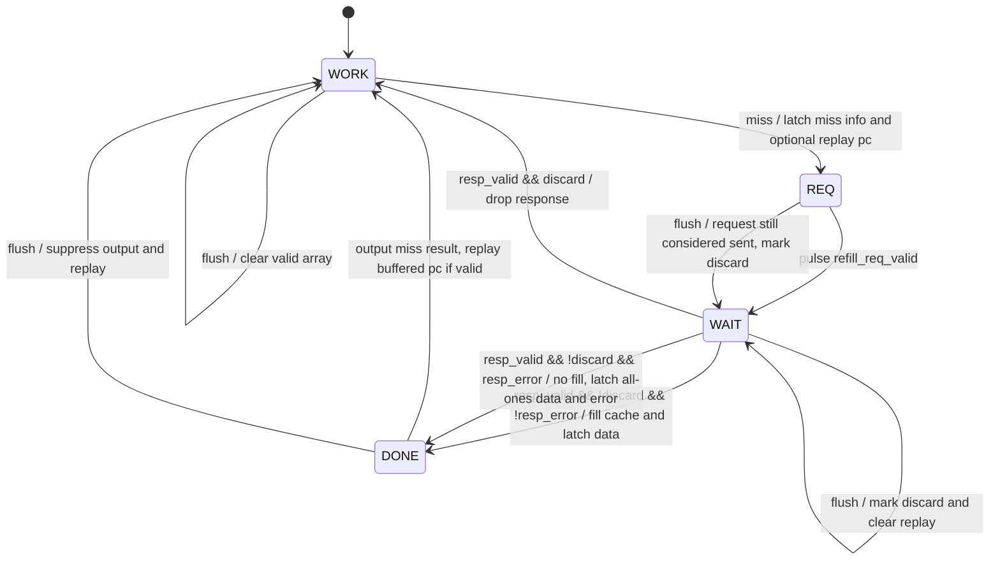

# ICache 设计约束

## 取指宽度（Fetch Width）

当前的 ICache 实现仅允许 `FETCH_BYTES == 16`，也就是说每个周期最多取 4 条指令。

同时，传入 ICache 的 fetch 起始 PC 必须满足 `FETCH_BYTES` 对齐。

这样约束的原因是：

- 前端当前假设一次取指返回的就是一组固定宽度的指令。
- ICache 内部按 `NUM_BANKS = ICACHE_BLOCK_SIZE_BYTES / FETCH_BYTES` 把一条 cache line 横向切分成多个 bank。
- 每个 data bank 一次返回一个 `FETCH_BYTES` 宽度的数据块。
- 如果 `FETCH_BYTES` 变化，bank 划分、地址位切分、返回数据组织方式都需要一起调整。

在 `rtl/frontend/icache.sv` 中已经有对应参数检查：

```systemverilog
assert (FETCH_BYTES == 16)
    else $fatal(1, "ICache: only FETCH_BYTES == 16 (4 instructions per fetch) is supported, got %0d", FETCH_BYTES);
```

## Data SRAM 组织

当前 ICache 的 data array 按 `way x bank` 组织。

- `ICACHE_WAYS` 表示 cache 的 way 数。
- `NUM_BANKS = ICACHE_BLOCK_SIZE_BYTES / FETCH_BYTES` 表示每条 cache line 被切成多少个 fetch-width bank。
- 每个 way 都拥有自己完整的一组 data banks。
- 因此 data SRAM 的总实例数是 `ICACHE_WAYS * NUM_BANKS`。

每个 data bank 的属性为：

- `DATA_WIDTH = FETCH_BYTES * 8`
- `SRAM_ENTRIES = NUM_SETS`

也就是说，每个 data SRAM:

- 宽度上只存一个 `FETCH_BYTES` 数据块
- 深度上按 set 数组织

## PC 地址字段划分

在当前设计里，PC 按下面这些字段来理解：

`PC = { tag, set_index, bank_index, word_index_in_bank, byte_offset }`

各字段含义如下。

### `byte_offset`

- 宽度：`2`
- 含义：32 位指令内部的字节偏移

当前不实现 C 扩展，所有指令固定 32 位，因此：

- `PC[1:0]` 恒为 `2'b00`

这两位不参与 ICache 的 tag/set/bank 寻址。

### `word_index_in_bank`

- 宽度：`$clog2(FETCH_BYTES / 4)`
- 含义：当前 PC 在一个 fetch-width data bank 中，对应第几条 32 位指令

从数据组织角度看，每个 data bank 的总数据宽度是：

- `DATA_BANK_WIDTH = FETCH_BYTES * 8`

而每条指令固定是 32 位，也就是 4B，因此一个 data bank 内一共包含：

- `FETCH_BYTES / 4`

条 32 位指令。

所以 `word_index_in_bank` 正好用于在这 `FETCH_BYTES / 4` 条指令中选择第几条，选择范围为：

- `0` 到 `FETCH_BYTES / 4 - 1`

对应到 bank 内部数据排布时，可以理解为：

- 第 `0` 条指令对应 `data_bank[word 0]`
- 第 `1` 条指令对应 `data_bank[word 1]`
- ...
- 第 `FETCH_BYTES / 4 - 1` 条指令对应最后一个 32 位 word

如果用当前固定配置来直观看，就是：

- `FETCH_BYTES = 16`
- `DATA_BANK_WIDTH = 128`
- 一个 bank 内有 `16 / 4 = 4` 条 32 位指令
- 因此 `word_index_in_bank` 宽度为 `2`

这里要注意，这个字段表示的是：

- 当前 PC 在 bank 内的 32 位 word 偏移

它不是天然意义上的“本次 fetch 返回数组里的第几条槽位”。只有当 fetch 起始地址本身被约束为 `FETCH_BYTES` 对齐时，这个字段才会在 fetch 起始 PC 上恒为 0。

### `bank_index`

- 宽度：`$clog2(NUM_BANKS)`
- 其中 `NUM_BANKS = ICACHE_BLOCK_SIZE_BYTES / FETCH_BYTES`
- 含义：当前 PC 所在 cache line 内，是第几个 fetch-width bank

这个字段用于在一条 cache line 的多个 data banks 之间进行选择。

### `set_index`

- 宽度：`$clog2(NUM_SETS)`
- 含义：访问 tag/data SRAM 时所使用的 set 编号

data SRAM 和 tag SRAM 的 entry 都按 `NUM_SETS` 组织，因此这一段地址直接决定访问 SRAM 的哪一个 entry。

### `tag`

- 宽度：剩余高位
- 含义：用于 tag compare 的地址高位

可以表示为：

- `ADDR_WIDTH - 2 - $clog2(FETCH_BYTES / 4) - $clog2(NUM_BANKS) - $clog2(NUM_SETS)`

## 当前实现采用的取指约束

当前实现采用的简化约束是：

- fetch 请求的起始 PC 必须按 `FETCH_BYTES` 对齐

在当前版本中，又因为 `FETCH_BYTES = 16`，所以这里的约束可以直接写成：

- fetch 请求的起始 PC 必须按 16B 对齐

也就是：

- `fetch_pc[3:0] == 4'b0000`

也就是说，当前 fetch 起始 PC 满足：

- `byte_offset == 2'b00`
- `word_index_in_bank == 2'b00`

因此，从当前 fetch 起始地址的角度看，可以把地址写成：

`fetch_pc = { tag, set_index, bank_index, word_index_in_bank, byte_offset }`

而在当前 16B 对齐取值约束下，这些字段的实际取值关系是：

- `byte_offset = fetch_pc[1:0] = 2'b00`
- `word_index_in_bank = fetch_pc[3:2] = 2'b00`
- `bank_index = fetch_pc[4 + $clog2(NUM_BANKS) : 4]`
- `set_index = fetch_pc[4 + $clog2(NUM_BANKS) + $clog2(NUM_SETS) : 4 + $clog2(NUM_BANKS)]`
- `tag = fetch_pc[ADDR_WIDTH - 1 : 4 + $clog2(NUM_BANKS) + $clog2(NUM_SETS)]`

换句话说，在当前实现中，fetch 起始 PC 的位分布可以理解为：

- `fetch_pc[1:0]`
  - 32 位指令内部字节偏移
  - 固定为 `00`
- `fetch_pc[3:2]`
  - 16B bank 内第几条 32 位指令
  - 因为当前 fetch 起始地址按 16B 对齐，所以固定为 `00`
- `fetch_pc[4 + $clog2(NUM_BANKS) - 1 : 4]`
  - 当前地址位于一个 cache line 的第几个 bank
- `fetch_pc[4 + $clog2(NUM_BANKS) + $clog2(NUM_SETS) - 1 : 4 + $clog2(NUM_BANKS)]`
  - 当前访问第几个 set
- `fetch_pc[ADDR_WIDTH - 1 : 4 + $clog2(NUM_BANKS) + $clog2(NUM_SETS)]`
  - tag compare 使用的高位地址

因此，当前 16B 对齐取指时，真正参与 ICache 定位的 PC 位段就是：

- bank 对应的那几位
- set 对应的那几位
- tag 对应的高位

这也意味着当前真正参与 ICache 寻址和命中的字段是：

- `tag`
- `set_index`
- `bank_index`

而 `word_index_in_bank` 在当前版本里主要是一个概念上保留的字段。后续如果允许非 `FETCH_BYTES` 对齐取指，或者允许跨 bank 取指拼接，那么这个字段才会重新参与实际的数据选择逻辑。

## 下一级存储访问接口

ICache miss 后会通过一组脉冲式接口访问下一级存储。当前先定义接口形状，完整 miss/refill 状态机后续再落地。

### Refill Request

request 端口由 ICache 发出，用来请求一整条 cache line。

- `refill_req_valid`
  - ICache 发出的单周期脉冲。
  - 当该信号为 `1` 时，`refill_req_pc` 有效。
- `refill_req_pc`
  - 请求地址。
  - 必须按 `ICACHE_BLOCK_SIZE_BYTES` 对齐，也就是 cache-line aligned。
  - 下一级存储按该地址返回完整 cache line。

当前约定 request 不是 ready/valid 握手，而是 pulse 协议。ICache 一旦拉高 `refill_req_valid`，就认为请求已经发出，后续必须等待对应 response。

### Refill Response

response 端口由下一级存储返回，用来交付一整条 cache line。

- `refill_resp_valid`
  - 下一级存储返回的单周期脉冲。
  - 当该信号为 `1` 时，`refill_resp_pc` 和 `refill_resp_data` 有效。
- `refill_resp_pc`
  - 返回数据对应的 cache-line 起始地址。
  - 必须和原 request 的 cache-line aligned PC 对应。
- `refill_resp_error`
  - 返回错误标志。
  - 当 `refill_resp_valid` 为 `1` 且该信号为 `1` 时，表示这次取 cache line 发生错误。
  - error 为 `1` 时，`refill_resp_data` 不可信，ICache 不能把该 cache line 写入 data/tag/valid array。
- `refill_resp_data`
  - 返回的一整条 cache line。
  - 宽度为 `ICACHE_BLOCK_SIZE_BYTES * 8`。

当前 ICache 只规划单 outstanding miss，因此正常情况下不会同时等待多个不同 PC 的 refill response。

### Flush 与 Refill 的关系

`flush` 不取消已经发往下一级存储的读请求。

如果 `flush` 发生在 miss/refill 流程中，ICache 仍然等待已经发出的 response，但该 response 回来后只用于闭合下一级访问协议：

- 不写回 data array。
- 不写回 tag array。
- 不置位 valid array。
- 不输出原 miss PC 的数据。
- 不 replay miss 期间暂存的后续 PC。

也就是说，`flush` 会让当前 miss 流程的 ICache 内部效果失效，但不会打断已经发出的下级存储访问。

## Miss / Refill 状态机

ICache 控制状态机先按单 outstanding miss 设计。正常命中路径保留当前 `s0 -> s1` 两级 lookup；miss 后暂时停止从外部接收新请求，等待下一级存储返回整条 cache line。

状态机包含四个主状态：

- `WORK`
  - 默认状态。
  - 执行当前流水式 cache lookup。
  - `s0_valid && s0_ready` 时，`s0_pc` 进入 `s1`。
  - `s1` 根据 tag/data/valid array 产生 hit/miss。
  - hit 时输出 `out_valid/out_pc/out_data/out_error=0`，状态保持 `WORK`。
  - miss 时记录 `miss_pc`、cache-line aligned refill PC、替换 way，并进入 `REQ`。
  - 如果 miss 同一拍又有新的 `s0_fire`，把这个后续请求暂存在单 entry buffer 中。这个 buffer 后续再正式命名，当前语义是 `replay_valid/replay_pc`。

- `REQ`
  - 发出单周期 `refill_req_valid` pulse。
  - `refill_req_pc` 必须是 `miss_pc` 对应的 cache-line aligned 地址。
  - request 是 pulse 协议，没有 ready/valid 握手；拉高 `refill_req_valid` 就认为请求已经发送。
  - 请求发出后进入 `WAIT`。

- `WAIT`
  - 等待下一级存储的 `refill_resp_valid` pulse。
  - 等待期间不再接受外部 `s0` 请求。
  - 如果 response 正常返回且没有被 flush 杀掉：
    - `refill_resp_error == 0` 时，写回 data/tag/valid array，并从返回的 cache line 中切出 `miss_pc` 对应的 `FETCH_BYTES` 数据。
    - `refill_resp_error == 1` 时，不写回 data/tag/valid array，并把 done 阶段要输出的数据置为全 `1`。
    - 两种情况都进入 `DONE`，由 `DONE` 对 miss 请求给出最终输出。
  - 如果 miss/refill 流程已经被 flush 杀掉，则 response 回来后不写 SRAM、不输出 miss 结果、不 replay buffer，直接回到 `WORK`。

- `DONE`
  - 对原 miss 请求输出一拍结果。
  - refill 正常时，`out_error=0`，`out_data` 为 refill line 中 `miss_pc` 对应的 `FETCH_BYTES` 数据。
  - refill error 时，`out_error=1`，`out_data` 固定为全 `1`，表示本次取指数据不可信。
  - 如果 replay buffer 有有效 PC，则在本状态内部把该 PC 重新送入 s0 lookup 路径，使其后续正常查 cache、正常 miss/refill。
  - 下拍回到 `WORK`。

### Flush 语义

`flush` 在不同阶段的含义不同：

- `WORK` 中发生 `flush`
  - 清空 valid array。
  - 清空当前 `s1_valid`。
  - 不需要清 SRAM data/tag 内容。
  - 保持或回到 `WORK`。
- `REQ/WAIT/DONE` 中发生 `flush`
  - 不取消已经视为发出的下级存储请求。
  - 清掉 miss 请求的有效性。
  - 清掉 replay buffer。
  - 标记当前 refill 结果需要丢弃。
  - 后续 response 回来时只用于闭合下级访问，不写回 SRAM、不输出、不 replay。

### 输出接口语义

正式取指输出只依赖：

- `out_valid`
- `out_pc`
- `out_data`
- `out_error`

`out_hit` 暂时保留用于兼容和 debug，但不作为正式下游接口语义。

输出规则如下：

- `WORK` 命中：
  - `out_valid = 1`
  - `out_pc = s1_pc`
  - `out_data = SRAM 命中的 FETCH_BYTES 数据`
  - `out_error = 0`
- `DONE` refill 正常：
  - `out_valid = 1`
  - `out_pc = miss_pc`
  - `out_data = refill line 中 miss_pc 对应的 FETCH_BYTES 数据`
  - `out_error = 0`
- `DONE` refill error：
  - `out_valid = 1`
  - `out_pc = miss_pc`
  - `out_data = {FETCH_BYTES*8{1'b1}}`
  - `out_error = 1`

### 状态转换图


